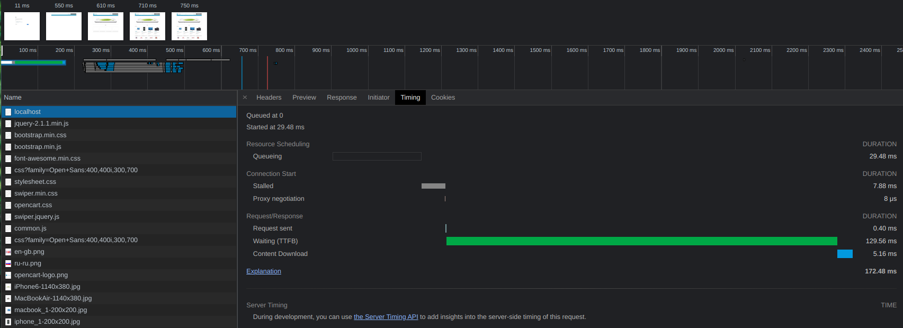
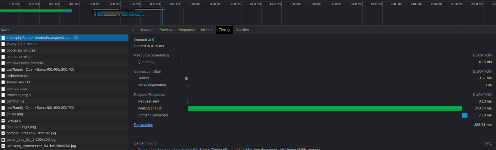
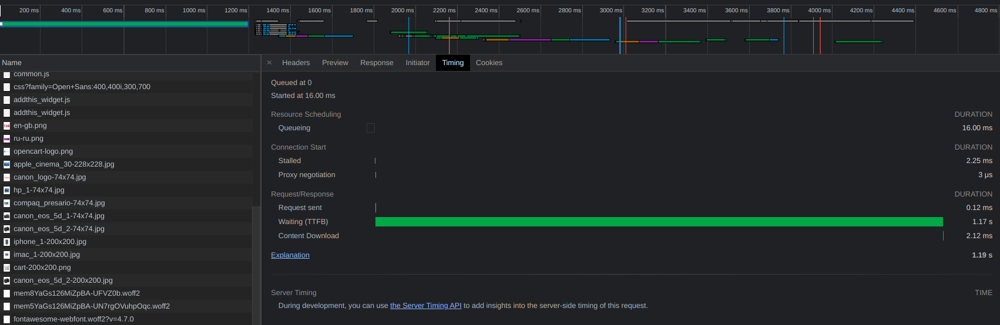
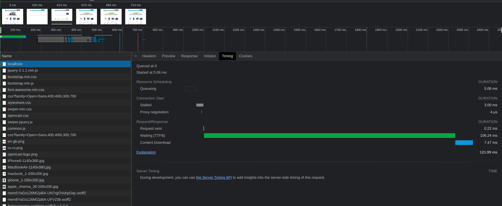
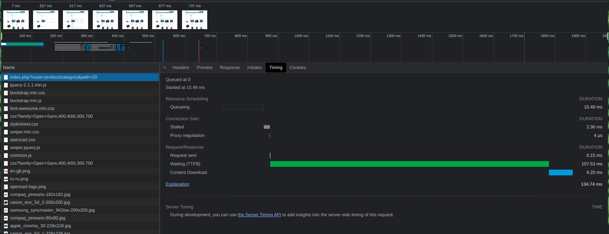
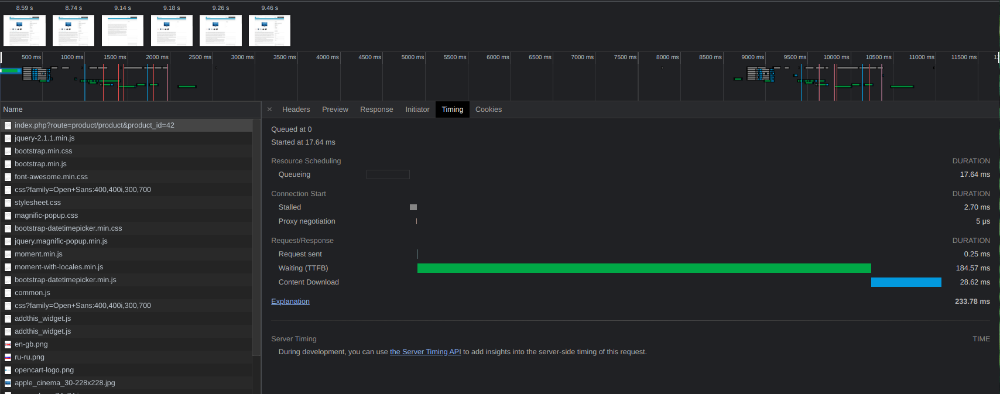

##Результаты бенчмарков

litespeed 

bench.php
    simple 0.014  
    simplecall 0.007   
    simpleucall 0.006   
    simpleudcall 0.006   
    mandel 0.118   
    mandel2 0.146  
    ackermann(7) 0.036   
    ary(50000) 0.004   
    ary2(50000) 0.003   
    ary3(2000) 0.039   
    fibo(30) 0.060   
    hash1(50000) 0.011   
    hash2(500) 0.008   
    heapsort(20000) 0.032   
    matrix(20) 0.035   
    nestedloop(12) 0.052   
    sieve(30) 0.012   
    strcat(200000) 0.005   
    ------------------------  
     Total 0.594  

##ttfb homepage
    

##ttfb category
    

##ttfb product
    

nginx

bench.php
    simple 0.014   
    simplecall 0.006   
    simpleucall 0.006   
    simpleudcall 0.006   
    mandel 0.093  
    mandel2 0.126  
    ackermann(7) 0.037  
    ary(50000) 0.004  
    ary2(50000) 0.005  
    ary3(2000) 0.043  
    fibo(30) 0.059  
    hash1(50000) 0.009  
    hash2(500) 0.008  
    heapsort(20000) 0.030  
    matrix(20) 0.032  
    nestedloop(12) 0.054  
    sieve(30) 0.011  
    strcat(200000) 0.005  
    ------------------------  
    Total 0.547  

##ttfb homepage
    

##ttfb category
    

##ttfb product
    
